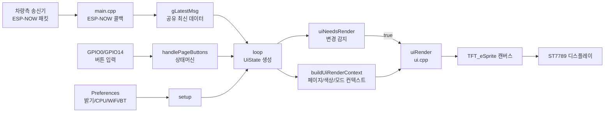

# Tesla CAN Monitor for T-Display-S3

ESP32-S3 LILYGO T-Display-S3 기반 Tesla CAN 상태 모니터 프로젝트입니다.
송신기(차량측)에서 ESP-NOW로 전달한 상태를 수신해 4개 페이지 UI로 표시합니다.

## 주요 기능

- ESP-NOW 텔레메트리 수신 (채널 고정: 1)
- 수신 채널 드리프트 감지 및 자동 복구
- 52바이트 신규 페이로드 수신
- 22바이트 레거시 페이로드 하위 호환 수신
- 4페이지 순환 UI (MAIN / A DETAIL / B DETAIL / SYSTEM)
- 버튼 상태머신 입력 처리 (디바운스, 클릭, 홀드, 반복)
- 밝기 조절 모드 (10% 단위, 홀드 반복 입력)
- 시스템 편집 모드 (CPU/WiFi/BT/밝기 빠른 진입)
- WiFi/BT 런타임 ON/OFF 토글 및 공존 정책 적용
- CPU 프로파일 전환 (80/160MHz)
- Preferences 기반 설정 영속화 (밝기, CPU, WiFi, BT)
- 링크 끊김 시 NO SIGNAL 표시
- 링크 끊김 디바운스 및 재연결/손실 진단 로그
- UI 렌더링 모듈 분리 (`ui.h`, `ui.cpp`)

## 아키텍처 구조

아래 구조는 "데이터 수신"과 "화면 렌더링"을 분리한 현재 코드 흐름입니다.



### 초보자용 해설

- `main.cpp`는 "제어자" 역할입니다. 입력, 무선 수신, 설정 저장/복원을 담당합니다.
- `ui.cpp`는 "화면 전용" 역할입니다. 전달받은 상태를 어떻게 그릴지만 신경 씁니다.
- `UiState`는 한 프레임에서 보여줄 값 묶음입니다.
- `UiRenderContext`는 현재 페이지, 편집 모드, 색상 테마 같은 "그리는 규칙" 묶음입니다.
- `uiNeedsRender`는 바뀐 게 없으면 다시 그리지 않게 하여 깜빡임과 CPU 사용을 줄입니다.

## 하드웨어 기준

- 보드: LILYGO T-Display-S3
- 디스플레이: ST7789 170x320 (TFT_eSPI Setup206)
- 전원 핀: GPIO15 HIGH 필요
- 버튼: GPIO14(UP), GPIO0(DOWN)
- 백라이트: GPIO38 (보드 전용 16단계 레벨 제어)

## 페이지 구성

### 1) MAIN
- EAP 상태
- NAG 상태
- A 채널 Hz
- B 채널 Hz
- Nag 모드 (DYNAMIC/FIXED)

### 2) A CHANNEL DETAIL
- A Frame Rate
- A Frames Total
- A ID 1021
- A EAP Modified
- EAP Runtime
- Uptime

### 3) B CHANNEL DETAIL
- B Frame Rate
- B Frames Total
- B ID 880/921
- B Echo Count
- Nag Mode
- TWAI 상태 / BusOff

### 4) SYSTEM STATUS
- CPU Profile (80/160MHz)
- WiFi Runtime (ON/OFF)
- Bluetooth Runtime (ON/OFF 또는 빌드 비활성)
- Brightness 상태
- Heap Free
- Uptime

## 버튼 동작 요약

- 일반 모드
- DOWN 짧게: 다음 페이지
- UP 짧게: 이전 페이지
- UP 3초 홀드: 밝기 조절 모드 진입
- 밝기 모드
- UP/DOWN 짧게: ±10%
- UP/DOWN 홀드: 반복 증감
- 입력 3초 없음: 저장 후 이전 페이지 복귀
- 시스템 모드 (SYSTEM 페이지에서 DOWN 2초 홀드로 진입)
- UP/DOWN 짧게: 항목 이동
- UP 1초 홀드: 현재 항목 실행
- DOWN 1.5초 홀드: 시스템 모드 종료

## 빌드

### 요구사항
- PlatformIO
- USB 연결된 T-Display-S3

### 빌드 명령

```bash
pio run -e lilygo-t-display-s3
```

### 업로드 명령

```bash
pio run -e lilygo-t-display-s3 -t upload
```

### 시리얼 모니터

```bash
pio device monitor -b 115200
```

## 수신 페이로드 버전

### 최신(52 bytes)
- uptime
- hz_a, hz_b
- nag_active, eap_active
- nag_mode, twai_state
- echo_count, tx_fail_count
- a_frames_total, a_frames_1021, a_eap_modified
- b_frames_total, b_frames_880, b_frames_921, b_busoff_count

### 레거시(22 bytes)
- uptime
- hz_a, hz_b
- nag_active, eap_active
- echo_count, tx_fail_count

레거시 수신 시 모드/상세 카운터는 기본값으로 표시됩니다.

## 설정 영속화 키

- `bright`: 밝기(%)
- `cpu_mhz`: CPU 프로파일
- `wifi_on`: WiFi 런타임 상태
- `bt_on`: Bluetooth 런타임 상태

## 릴리즈

변경 이력은 CHANGELOG.md를 참고하세요.
