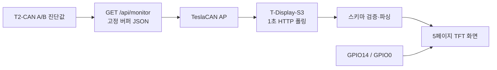

# T2-CAN 전용 T-Display-S3 모니터

LILYGO T-Display-S3를 차량 보드의 **읽기 전용 보조 화면**으로 사용하는 독립 PlatformIO 프로젝트입니다. T-Display-S3가 T2-CAN의 Wi-Fi AP에 자동 연결하고 경량 HTTP 상태 API를 1초마다 읽어 A/B CAN 채널, HW3 기능, Summon 게이트와 시스템 상태를 표시합니다.

이 장치는 차량 CAN에 직접 연결하거나 CAN 프레임을 송신하지 않습니다. T2-CAN 설정 변경, OTA, POST 요청도 제공하지 않습니다.

## 확정 구조

| 항목 | 설정 |
|---|---|
| T2-CAN 역할 | Wi-Fi AP + 읽기 전용 상태 API 제공 |
| T-Display-S3 역할 | Wi-Fi STA + 전용 상태 화면 |
| SSID | `TeslaCAN` |
| 비밀번호 | `asdf1234` |
| 서버 | `http://192.168.4.1` |
| 상태 API | `GET /api/monitor` |
| 스키마 | `1` |
| 폴링 주기 | 1초 |
| 신호 손실 표시 | 마지막 정상 응답 후 3.2초 |

두 프로젝트는 별도 Git 저장소로 유지합니다.

- T2-CAN: `/Users/akanus/t2-can-board`
- 모니터: `/Users/akanus/T-Display-S3`

## 주요 기능

- `TeslaCAN` 자동 연결 및 2초 간격 재연결
- HTTP 연결 500ms, 응답 700ms 제한으로 화면 장시간 정지 방지
- 스키마 1 JSON 검증과 파싱 실패 횟수 표시
- 마지막 정상 응답이 3.2초를 넘으면 `NO SIGNAL` 표시
- T2-CAN의 CAN 송신·NVS·로그 상태를 바꾸지 않는 읽기 전용 동작
- 5페이지 모니터 UI
  - `OVERVIEW`: A/B 상태, 주요 기능, USER_MARK
  - `A CHANNEL`: MCP2515 상태, EFLG, TEC/REC, RX 오버런, TX 결과
  - `B CHANNEL`: TWAI 상태, BUS-OFF, 복구 대기, ARB/버스/TX 오류
  - `FEATURES`: ECE R79, Summon, TSLLC, Nag 모드, AP·게이트 상태
  - `SYSTEM`: 펌웨어·OTA, 데이터 지연, RSSI, HTTP 성공/실패/파싱 오류
- 밝기 10% 단위 조절과 CPU 80/160MHz 선택
- Light / Dark 테마 전환 (SYSTEM 편집 모드, Preferences 저장)
- 과거 `wifi_on`, `bt_on` NVS 값 무시
  - 모니터 Wi-Fi는 항상 켬
  - Bluetooth는 항상 끔
- **320×170 실측 웹 프리뷰** (`preview/index.html`) — 플래시 없이 페이지/테마 검증

## 화면 디자인 워크플로

```bash
open preview/index.html
```

`preview/index.html`은 **펌웨어 연동 프리뷰**입니다.

| 연동 | 내용 |
|---|---|
| 소스 | `src/ui.cpp` / `src/ui.h` / `src/main.cpp` |
| 포맷 | `snprintf` 문자열 규칙 (`%.1fHz / %lums`, `0x%02X`, NAG `ON M1` 등) |
| 좌표 | 헤더/카드/행 y좌표 (A·B·FEATURES step 20, SYSTEM step 17) |
| 테마 | `uiApplyThemePalette` Dark/Light RGB 동일 |
| 모드 | PageView / BrightnessAdjust / SystemEdit 하이라이트 |
| 비연동 | 실제 HTTP `/api/monitor` 폴링, GPIO 버튼 상태머신 |

1. 프리뷰에서 페이지 0~4, Brightness mode, System edit 확인
2. 우측 UiState 필드를 바꿔 문자열 dump와 화면이 펌웨어와 같은지 검증
3. 페이지 하단 **기능별 연동 매트릭스**로 SYNC 여부 확인
4. 기기에서 **DOWN 3초**로 테마 토글 (또는 SYSTEM 편집 → Theme → UP 1초)

## 화면 조작

### 일반 모드

- UP 짧게: 다음 페이지
- DOWN 짧게: 이전 페이지
- UP 3초: 밝기 조절 진입
- **DOWN 3초 (SYSTEM 제외): 테마 DARK↔LIGHT 토글** (즉시 저장, 약 0.8초 토스트)

### 밝기 조절

- UP / DOWN: 10% 단위 조절
- 버튼 홀드: 연속 조절
- 3초간 입력 없음: 저장 후 이전 화면 복귀

### 시스템 편집

- SYSTEM에서 DOWN 2초: 편집 진입 (SYSTEM에서는 테마 단축키 대신 편집 우선)
- UP / DOWN 짧게: CPU · Brightness · Theme 항목 이동
- UP 1초: 선택 항목 실행 (Theme는 DARK↔LIGHT 토글)
- DOWN 1.5초: 편집 종료
- 하단 힌트: `DN3s:THEME  DN2s:EDIT  Theme row: UP-hold toggle`

## 하드웨어

| 항목 | 내용 |
|---|---|
| 보드 | LILYGO T-Display-S3 |
| 디스플레이 | ST7789 170x320, 가로 모드 |
| 전원 활성 | GPIO15 HIGH |
| UP 버튼 | GPIO14 |
| DOWN 버튼 | GPIO0 |
| 백라이트 | GPIO38 |
| 기본 CPU | 80MHz |
| Wi-Fi | 2.4GHz |

## 데이터 흐름


```mermaid
flowchart LR
    CAN[T2-CAN A/B 진단값] --> API[GET /api/monitor\n고정 버퍼 JSON]
    API --> WIFI[TeslaCAN AP]
    WIFI --> HTTP[T-Display-S3\n1초 HTTP 폴링]
    HTTP --> PARSE[스키마 검증·파싱]
    PARSE --> UI[5페이지 TFT 화면]
    BUTTON[GPIO14 / GPIO0] --> UI
```

상세 필드와 호환 규칙은 [모니터 API 문서](docs/monitor-api.md)를 참고하십시오.

## 빌드와 업로드

```bash
pio run -e lilygo-t-display-s3
pio run -e lilygo-t-display-s3 -t upload
pio device monitor -b 115200
```

정상 빌드 뒤 OTA·보관용 복사본은 다음 규칙으로 만듭니다.

```text
YYYY-MM-DD_짧은변경요약.bin
```

예: `2026-08-04_T2CAN-WiFi모니터.bin`

## 안전 확인

1. 먼저 T2-CAN 펌웨어에 `/api/monitor`가 포함되어 있는지 확인합니다.
2. T-Display-S3만 USB 전원으로 부팅해 `TeslaCAN` 연결과 화면 수신을 확인합니다.
3. T-Display 화면을 조작해도 T2-CAN 기능 토글이나 CAN TX 카운터가 조작 때문에 변하지 않아야 합니다.
4. T2-CAN 재부팅·OTA 동안 `NO SIGNAL`이 표시되고, 재부팅 완료 뒤 자동 복구되는지 확인합니다.
5. 이 화면은 보조 진단 수단입니다. 차량 경고나 Web UI의 상세 로그보다 우선하지 않습니다.

## 설정 저장

Preferences의 다음 값만 사용합니다.

- `bright`: 화면 밝기
- `cpu_mhz`: 80/160MHz 프로파일
- `theme`: UI 테마 (`0`=DARK, `1`=LIGHT)

이전 펌웨어의 `wifi_on`, `bt_on` 값은 자동 연결을 방해하지 않도록 읽지 않습니다.

## 변경 이력

[CHANGELOG.md](CHANGELOG.md)에 한글로 기록합니다.
